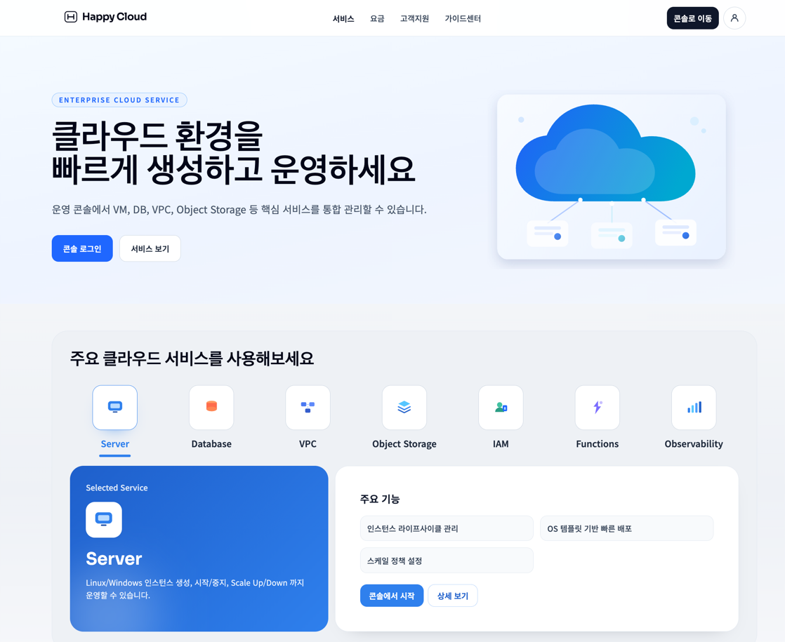
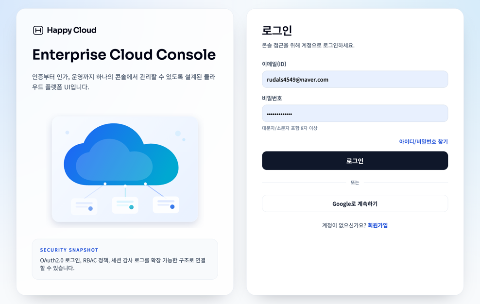
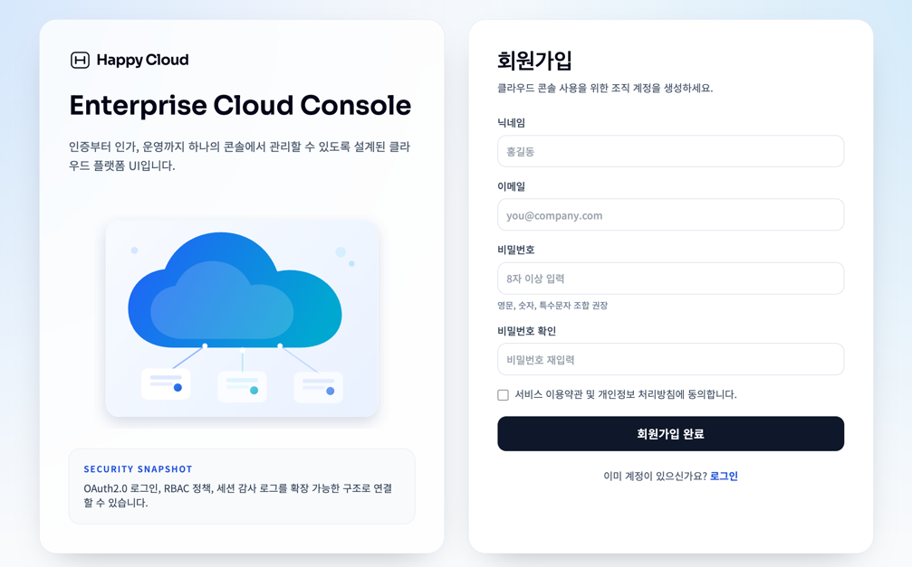
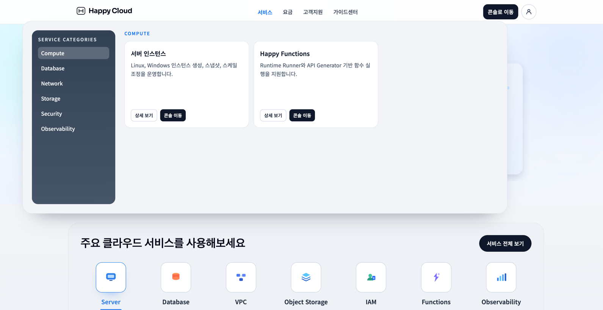
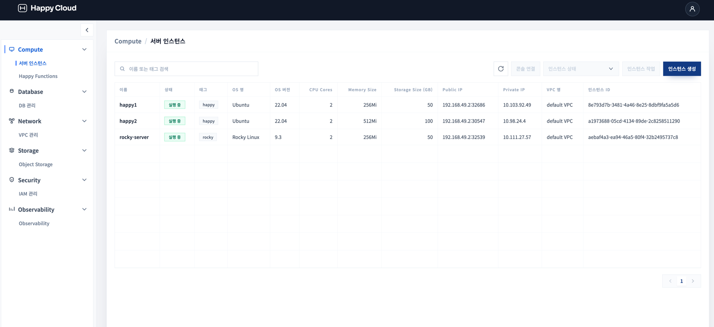
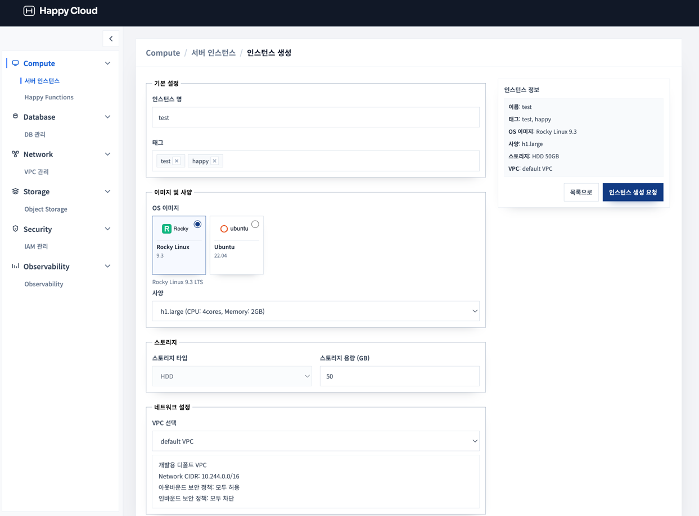
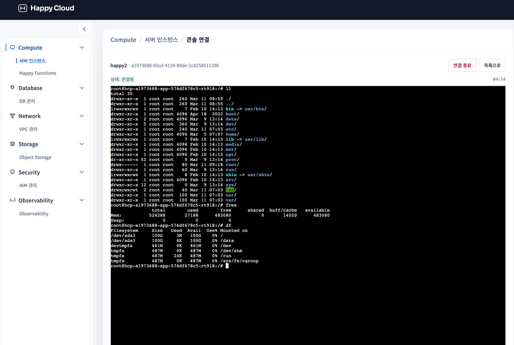

# Happy Cloud Platform UI

Cloud Platform UI


### System Requirements

- [nextjs] 14.2.33
- [react] 18.3.1
- [typescript] 5.7.2
- [tailwindcss] 3.4.17

### 디렉토리 구조

```text
src
├─ app            # Next App Router
├─ entities       # 도메인 엔티티
├─ features       # 유저 기능 단위
├─ processes      # 비즈니스 프로세스 흐름
├─ shared
│  ├─ api         # axios client, api 호출
│  ├─ config      # 환경변수/설정
│  ├─ constants   # 상수
│  ├─ hooks       # 공용 hooks
│  ├─ lib         # 유틸/헬퍼
│  ├─ stores      # zustand stores
│  ├─ styles      # 공용 스타일
│  ├─ types       # 공용 타입
│  └─ ui          # 공용 UI 컴포넌트
└─ widgets        # 복합 UI 블록
```

### UI

* 랜딩 페이지



* 로그인 / 회원가입






* 서버 인스턴스 목록 / 생성







* 인스턴스 콘솔 연결




